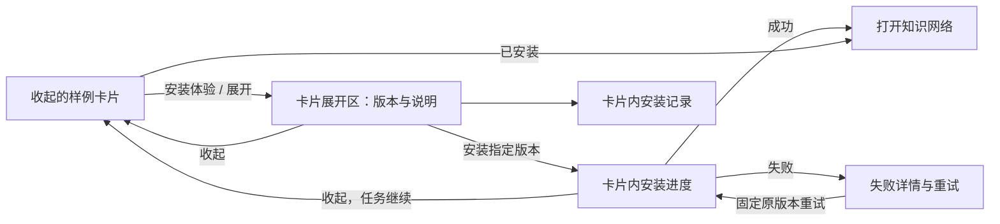

# 首页一键体验交互设计

最新实现补充：工作区已支持选择正式可安装版本，并在确认与创建请求中使用该版本的清单摘要；切换版本会清除旧确认，说明加载失败或版本被撤回时不能开始安装。已安装卡片不增加升级入口。28 个首页受影响测试、类型、定向 lint 和构建通过；本轮未部署或提交，真实远程全新安装验收仍待执行。此前 localhost:8081 的异步安装、浏览器硬中断与重试验收保留。完整历史、多副本仍未实现。

日期：2026 年 10 月 9 日。状态：设计草案；首页候选已部署，完成供应链页面安装与网络入口验收，未提交。

## 目标与范围

用户在首页发现官方样例，查看版本说明，安装后进入知识网络；随时查看实际安装版本和历史。保留当前「AI Skills 构建 / 手动构建 / 一键体验」入口和现有列表卡片。

首期采用可展开、收起的样例卡片，在同一张卡片内完成版本说明、安装确认和记录查看，不新增向导、独立商城或来源设置页。只对接官方源和一条固定安装链路。升级、卸载、第三方源和通用插件管理延后。

## 当前实现核对

| 现状与源码                                                            | 对交互的影响                                       | 调整                                                           |
| --------------------------------------------------------------------- | -------------------------------------------------- | -------------------------------------------------------------- |
| `HomeScene.tsx` 通过 `?path=sample` 切换体验区                        | 入口已存在，无需改首页信息架构                     | 保留入口与 URL 状态                                            |
| `SampleExperience.tsx` 仅在全部样例版本相同时显示顶部 `sharedVersion` | 不支持各样例独立版本的清晰展示                     | 版本放在各自卡片；区块顶部显示来源和刷新结果                   |
| `SampleCatalogItem` 只有一个 `version`；已安装文案使用 `item.version` | 目录版本和实际安装版本可能混淆                     | 分开最新版本、选中版本、实际安装版本                           |
| 后端 `_card` 已返回 `installedVersion`，前端解析器未保留              | 已有实际版本信息被丢弃                             | 优先消费该字段；旧记录缺失时显示“版本未记录”，不猜成最新版本   |
| 前端读取 `installedAt`，当前后端 `_card` 未返回                       | 安装时间可能显示为空                               | 后端补真实成功时间；缺失时省略时间，不能填浏览器当前时间       |
| service 仅有目录、创建、单条安装查询和重试                            | 没有版本说明、历史或扫描源接口                     | 配套补接口；GET 当前目录不能被宣传为扫描仓库                   |
| 创建安装 POST 空 body，最长等待 30 分钟；后端同步返回                 | 无法提交指定版本，也不能可靠区分断网与安装失败     | 后端异步接受固定版本计划，页面跟踪持久任务                     |
| 确认弹窗主要展示 namespace、Catalog 和网络名                          | 用户更需要知道将安装哪个版本、能体验什么和资源影响 | 将版本、说明与实际影响作为主要内容，技术名称收起               |
| 问题列表仅在安装后出现；主操作为打开知识网络                          | 安装前难判断样例价值                               | 安装前可看场景问题，成功后继续使用现有知识网络入口             |
| actionError 位于整个列表上方；失败提示包括直接删除或改名冲突网络      | 多样例同时安装时难识别归属；处理建议缺少业务上下文 | 错误放回所属卡片；冲突展示资源并建议管理员核对，不直接指导删除 |
| 正常状态没有刷新按钮；查询安装失败被静默吞掉                          | 无法主动找新样例，也无法判断进度是否更新           | 常驻刷新入口，显示最后成功刷新时间；查询失败提示状态暂未更新   |

以上为源码事实与设计判断，不代表已在运行实例重现所有问题。

## 列表卡片

标题「一键体验」，说明「选择官方样例，将数据和知识网络安装到当前环境后开始体验。」不使用“冒烟”等工程术语。

区块工具栏：官方来源、最后成功刷新时间、`刷新样例`。成功区分“发现更新”和“暂无更新”；刷新失败保留旧目录并标记时间。服务尚未支持远程扫描时，只能使用“重新加载”的实际语义。

每张卡片包含：

- 样例名称和简短业务场景；可体验问题放在展开区。
- 最新发布版本；已有安装时另外显示“已安装 vX”。有更高版本时显示“有新版本”，不自动更新或重新安装。
- 当前安装状态与明确的不可安装原因。
- 一个主操作与 `展开 / 收起`；版本说明、场景问题及安装记录放在展开区。

| 状态         | 主操作                             | 信息                                             |
| ------------ | ---------------------------------- | ------------------------------------------------ |
| 未安装       | `安装体验`（展开卡片，不立即写入） | 默认选最新可安装版本；找不到兼容版本时说明原因   |
| 正在安装     | `查看进度`                         | 当前阶段及目标版本；不能重复创建                 |
| 已安装       | `打开知识网络`                     | 实际成功版本；展开后默认查看该版本说明           |
| 安装失败     | `查看失败详情`                     | 收起时显示错误摘要，展开后提供重试               |
| 当前不可安装 | 保留 `展开`                        | 区分权限不足、平台不兼容、版本撤回或来源检查失败 |

非管理员仍可看样例和版本说明。打开已安装网络由平台资源权限决定；不能仅因无安装权限就隐藏体验入口。

## 展开与收起规则

默认全部收起，一次最多展开一张。卡片标题旁设置明确的展开按钮；主操作独立，点击“打开知识网络”不会同时展开或收起。展开状态只属于页面展示，不改变服务器安装任务。

- 点击“安装体验”：展开该卡片，显示版本说明和安装确认。
- 点击“查看进度”或“查看失败详情”：展开并定位当前任务区域。
- 点击“展开”：展示样例版本与说明；已安装卡片默认查看成功安装版本。
- 点击“收起”：只隐藏详情，保留摘要区的版本、状态、当前阶段和网络入口。
- 开始安装后保持该卡片展开；用户可以主动收起，任务继续执行。轮询更新不会抢占用户正在查看的其他卡片，安装完成也不自动导航。
- 切换到另一张卡片再返回时，在当前页面会话内保留各样例的版本选择；全页刷新后按服务器记录初始化。刷新目录不悄悄替换已选版本；失效或撤回时提示重新选择。

展开区按顺序展示：版本选择与发布日期 → release notes → 场景问题 → 资源影响与安装确认 → 当前任务或安装记录。安装记录按需显示简单列表和“加载更多”，不增加第二层折叠或抽屉。收起卡片没有隐藏的可聚焦控件。

复用 Ant Design 和模块样式，无需新依赖。展开按钮支持键盘操作，通过 `aria-expanded`、`aria-controls` 关联内容区域。收起时若焦点在内容区内，先恢复到展开按钮；状态变化使用简短播报，避免每次轮询重复读出全部进度。

版本选择只列出发布源实际提供的版本。未安装时默认选择最新兼容版本；有安装记录时默认查看实际安装版本。切换版本同步切换说明和可安装原因。版本说明未成功加载时保留明确错误和重试，安装提交保持禁用，避免确认了未看见的版本信息。

release notes 按当前语言展示，回退时标明实际语言。若使用 Markdown 渲染，禁用原始 HTML/脚本并限制链接协议，使用项目既有安全渲染能力。历史说明来自该次安装的固定快照；撤回、目录刷新或离线不改写它。

卡片展开区的确认操作为 `安装 vX.Y.Z`，旁边可 `收起`；“收起”不表示取消任务。先展示简明资源影响：“将在当前环境创建该样例的数据资源和知识网络”；按后端预检返回实际资源与冲突，不由前端猜 namespace 或 Catalog。说明“首期暂不支持自动卸载与升级”。开始安装前只有这一次确认，不叠加第二个弹窗。

安装时固定当前版本和预检计划；如果目录更新、版本撤回或计划过期，服务拒绝旧计划并提示重新查看，不静默替换版本。接口尚未支持时不提前启用版本选择。

## 安装与历史

提交中禁用重复按钮；服务接受后显示持久任务。收起卡片或切换首页标签不会取消服务器任务。重新进入时按服务器任务恢复进度，不能靠浏览器内存宣布安装状态。

不显示推算百分比、虚构预计时间或前端计时完成。页面使用后端当前阶段；详细日志需要时再展开。网络错误显示“暂时无法获取安装状态”，保留最后已知状态并重查，不能直接判为安装失败后开始新任务。

失败详情包含目标版本、失败阶段、可理解原因与可执行建议。重试沿用同一固定版本和原任务，展示实际尝试次数。权限、兼容性、归属冲突须先解决，不能将所有错误都显示成“需要管理员”。

卡片内的安装记录列出目标版本、结果、开始/结束时间、操作者（实际身份可用时）、重试次数；按需加载更多。记录详情展示该版本说明快照和失败信息。成功版本来自成功记录；其他失败记录不覆盖它。首期有新版本仅可阅读说明，不提供升级按钮。

目录源暂不可用或某版本撤回时，历史及已有网络入口仍保留；新安装按照实例检查结果决定能否继续。

## 最小接口依赖（由实例提供）

| 能力           | 必要数据 / 行为                                                                                        |
| -------------- | ------------------------------------------------------------------------------------------------------ |
| 目录读取与刷新 | 样例聚合列表、版本列表/兼容原因、最新与已安装版本、最后成功刷新时间、当前刷新结果；浏览器不直连 GitHub |
| 指定版本说明   | 固定 sample/version、发布日期、说明内容与实际语言；接口设计沿用安装协议草案，避免另建 UI 私有协议      |
| 安装预检与创建 | 目标版本、固定清单摘要与计划、资源影响、幂等请求；异步返回任务                                         |
| 任务读取与重试 | 状态、阶段、版本、错误、尝试次数；按固定任务恢复与重试                                                 |
| 安装历史       | 成功版本/时间、历史记录与说明快照、分页；已有网络的真实资源引用                                        |

## 实施顺序

| 批次                  | 改动                                                                                          | 前提                               |
| --------------------- | --------------------------------------------------------------------------------------------- | ---------------------------------- |
| U0 卡片与当前接口整理 | 展开收起、每卡版本、读取 installedVersion、缺失时间处理、文案、卡片错误归属与进度读取失败反馈 | 可沿现有 API；修改前确认兼容 DTO   |
| U1 版本与详情         | 卡片展开区的版本选择、release notes、场景问题、刷新结果                                       | 实例目录扫描与版本说明接口可用     |
| U2 安装与记录         | 预检确认、异步任务、恢复重试、历史与成功入口                                                  | 固定版本计划和持久安装记录接口可用 |

文件主要为 `src/modules/home/{lib,services,scenes,locales}`。路由及首页三入口保持现有组织。先落库接口与交互约定，再逐批修改代码供 diff review。

## 验收用例（待实施时验证）

1. 两个样例版本不相同，卡片分别显示正确版本。
2. 已安装 1.0.0、目录发布 1.1.0：成功版本仍为 1.0.0，可查看两版说明，无自动升级。
3. 切换版本同步切换说明；撤回、不兼容和无权限给出对应原因。
4. 收起卡片、刷新浏览器后能恢复正在安装的任务；重复提交不生成第二份安装。
5. 请求超时不伪报安装失败；失败重试继续固定版本；新的失败不覆盖历史成功。
6. 刷新源失败仍显示缓存时间；已安装网络及历史入口保持可用。
7. 默认全收起且最多展开一张；切换卡片保留选择，轮询不自动展开或导航。
8. 中英文、展开按钮键盘操作、收起时焦点恢复、状态播报及窄屏布局正常。

## 当前实现进展

工作分支：`docs/sample-experience-interaction`。已实现默认收起、单卡展开、卡片内安装确认、收起后保留状态和当前阶段、每卡版本与 installedVersion 展示、卡片操作错误归属、中英文文案。确认区支持焦点进入及提交/取消后的焦点恢复；沿用原安装 API 和轮询机制。

后续本地补充：常驻重新加载、目录请求的旧响应丢弃、缓存提示、状态查询失败反馈与重查、失败详情展开后重试、缺失原任务 ID 时阻止重试，以及无 HTTP 响应时提示结果未确认。状态查询失败保留最后数据；任务读取自动轮询不重叠。目录版本在确认期间变化时禁用提交，提示重新确认。

跨仓库过渡接入已在本地实现：当前内置版本的中英文 release notes、说明读取失败时禁用提交、说明快照查询、真实成功时间、当前安装记录、提交版本与清单摘要及服务端核对。既有服务仅保留一条记录，页面明确提示历史不完整；旧服务未声明说明能力时保留原调用方式。

后续本地实现已增加官方目录刷新、刷新状态与时间、远程版本聚合、查看版本切换、发布日期、说明读取与不可安装原因。正式根 catalog.json 尚未发布，未做真实扫描联调。仅支持远程版本浏览；动态版本安装、完整历史、异步任务和完整幂等恢复仍待实现。接口范围见 bkn-samples 的 `docs/studio-version-api.md` 和 `docs/official-catalog-discovery.md`。现有场景测试的默认展开、确认和重试交互预期需要在测试批次核对。

已执行仓库锁定版本 Prettier 的定向格式化与 `git diff --check`；此前未安装依赖，未执行运行验证；最新检查与浏览器验收见下节。格式化成功不能证明运行时行为已验证。按 Studio 的 AGENTS.md，工作区 diff 待人工评审后再提交或推送。

### 2026-10-09 Studio 页面验收

首页候选已部署到 localhost:8081。通过浏览器供应链卡片执行查看说明、确认安装、进度跟踪、成功记录及打开知识网络；安装中收起和刷新后仍可恢复进度。五阶段成功，0.1.0 安装于 2026-10-09T06:16:20.275041Z，网络页显示 15 对象、21 关系、14 函数、3 SKILLs。旧安装状态已备份到服务 PVC acceptance-backups，数据库与网络保留，因此这是页面安装与资源复用验收，不能替代固定候选首次全新安装验收。25 个首页测试、类型检查、定向 lint、许可证检查与生产构建通过；构建仍有既有 chunk 大小提示。下一步先将同步安装改为接受任务后立即返回，再固定提交及全新验收，最后接正式目录与动态制品安装。证据：工作区 artifacts/acceptance/studio-ui。全部改动未提交、未推送。
