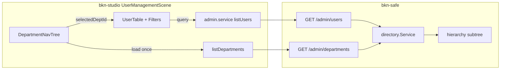

# 用户管理改造 — 需求、计划与任务

> **范围：** `bkn-studio` 用户管理页（`/studio/system/users`）+ `bkn-safe` 管理 API（`/api/safe/v1/admin/*`）  
> **后端仓库：** `D:\openbkn\bkn-foundry\bkn-safe`  
> **前端仓库：** `D:\openbkn\bkn-studio`  
> **目标形态：** 左树右表（组织树 + 用户列表），服务端分页与筛选，消除 N+1 与假分页

---

## 1. 背景与目标

### 1.1 背景

当前用户管理页将 **用户** 与 **部门/组织** 放在同一页的 Tab 中切换。日常运维以「找人、管账号」为主，组织树使用频率次之，但两者强关联（按部门筛用户、看成员归属）。

前端为实现部门列与部门筛选，在进页时：

1. 一次拉取最多 500 条用户（`GET /admin/users?limit=500`）
2. 拉取最多 1000 个部门
3. 对每个部门调用 `GET /admin/departments/:id/members`（N 次）
4. 拉取全量角色并对每个角色调详情（供角色列展示）

分页在浏览器内 `slice`，属于 **假分页**；部门列在成员接口未返回前显示不完整。

### 1.2 改造目标

| 目标 | 说明 |
|------|------|
| **左树右表** | 左侧组织树选中节点，右侧展示该范围用户；去掉用户/部门 Tab |
| **服务端分页** | 用户列表 `offset/limit/total` 与筛选参数走后端 |
| **消除 N+1** | 列表不再逐部门拉成员；树节点成员数由后端汇总 |
| **列表可扫读** | 用户行直接展示部门名、角色名摘要；状态用 Tag |
| **职责清晰** | 用户页专注账号与归属；组织 CRUD 在左侧树上下文完成 |
| **可渐进交付** | 分三期：前端布局 → 后端增强 → 企业扩展 |

### 1.3 非目标（本期不做）

依据 `bkn-safe/docs/admin-api-frontend-changes.md` 已定调：

- 部门扩展字段（负责人、编码、邮箱、备注）
- 独立于 `enabled` 的冻结状态
- 角色 `displayName` 独立字段
- 用户 CSV 导入导出（可放 P3）
- 将部门拆为完全独立顶级菜单（可选 P2，默认与用户同屏左树右表）

---

## 2. 现状分析

### 2.1 前端（bkn-studio）

| 模块 | 路径 | 现状 |
|------|------|------|
| 场景页 | `src/modules/system-admin/scenes/UserManagementScene.tsx` | Tab 切换用户/部门；客户端筛选与分页 |
| 组织树 | `src/modules/system-admin/components/DepartmentTree.tsx` | 可拖拽改父级；`selectable=false`；节点内嵌 4 个操作按钮 |
| 用户表单 | `src/modules/system-admin/components/UserFormDrawer.tsx` | 编辑时 `getUser` 拉详情；角色互斥逻辑完善 |
| 服务层 | `src/modules/system-admin/services/admin.service.ts` | `listUsers` 写死 `limit:500`；`mapUser` 列表不返 `departments` |
| 布局参考 | `src/modules/data-catalog/scenes/DataCatalogScene.module.css` | `grid 320px + 1fr` 左树右详情 |

### 2.2 后端（bkn-safe）

| 能力 | 现状 | 缺口 |
|------|------|------|
| `GET /admin/users` | `search`/`account`/`offset`/`limit`/`total`；`UserSummary` 无部门、角色、`updated_at` | 无 `department_id`/`enabled`/`role_id` 筛选；列表无 `departments`/`roles` |
| `GET /admin/users/:id` | 含 `departments`、`updated_at`；`roles` 字段未填充 | 编辑需额外 `GET /role-bindings` |
| `GET /admin/departments` | 扁平分页或 `?parent_id=` 子节点 | 无 `member_count` |
| `GET /admin/departments/:id/members` | 直接成员全量返回 | 无分页；不含子部门继承 |
| `GET /admin/roles` | 全量列表 + `?source=` | 无分页（可接受） |
| `POST /directory/search-org` | 可按部门子树筛用户 id | 非 admin 路由；前端未用于用户列表 |

关键代码位置：

- 路由：`server/internal/httpapi/router.go`、`directory.go`、`useradmin.go`、`authz.go`
- 领域服务：`server/internal/directory/directory.go`（`ListUsers`、`ListAllDepartments`）
- 子树语义：`server/internal/directory/hierarchy.go`（`SearchOrg`、`SearchOrgFull`）
- 契约文档：`docs/admin-api-frontend-changes.md`、`docs/API.md`

---

## 3. 功能需求

### 3.1 左树右表（FR-UI-01）

```
┌────────────────────┬──────────────────────────────────────────┐
│ 组织架构            │ 用户                                      │
│ [搜索部门]          │ [新建用户] [刷新]  搜索用户 | 状态 | 角色  │
│ [+ 新建根部门]      │ ┌────────────────────────────────────┐ │
│ ▼ 全部用户 (128)   │ │ 用户 | 部门 | 角色 | 状态 | 更新时间 │ │
│ ▼ BKN 平台 (12)    │ └────────────────────────────────────┘ │
│   ▼ 研发部 (5) ◀   │ 分页（服务端 total）                    │
│     数据组 (3)     │                                          │
└────────────────────┴──────────────────────────────────────────┘
```

- 左侧第一项：**全部用户**（虚拟节点，不按部门过滤）
- 选中部门节点：右侧用户列表按该部门过滤（见 FR-API-02）
- 左侧树展示：**部门名称 + 直接成员数**（`member_count`）
- 部门管理操作：选中节点后，左侧顶栏或节点右键提供「编辑 / 成员 / 新建子部门 / 删除」；树节点默认不展示 4 个 inline 链接（窄栏放不下）
- 拖拽改父级：保留，行为与现有一致
- 响应式：`<1200px` 时左栏折叠或上下堆叠（参考 DataCatalog）

### 3.2 用户列表（FR-UI-02）

| 列 | 要求 |
|----|------|
| 用户 | 显示名 + 登录名 + 邮箱；内置用户标注 `（内置）` |
| 部门 | 部门路径或名称，多条用 `、`；来自列表 API |
| 角色 | 直接绑定角色名，多条用 `、`；无则「未授予」 |
| 状态 | Tag：启用 / 停用 |
| 更新时间 | `updated_at` |
| 操作 | 编辑、重置密码、启用/停用、删除；内置用户禁用删除/停用 |

筛选：

- 关键词：姓名、登录名（服务端 `search`）；邮箱暂可客户端补筛或后端扩展
- 状态：启用 / 停用 / 全部（服务端 `enabled`）
- 角色：按直接绑定角色筛选（服务端 `role_id`）
- 部门：由左侧树选中态驱动（服务端 `department_id`），工具栏下拉可移除或只读展示当前部门

分页：`TablePaginationBar` + 服务端 `offset/limit/total`。

### 3.3 用户编辑（FR-UI-03）

保持现有 `UserFormDrawer` 能力，微调：

- 打开编辑仍 `getUser` 拉详情（直至列表/详情 API 补齐 `roles`）
- 保存后只刷新右侧列表 + 受影响部门的 `member_count`（若后端提供）

### 3.4 后端列表增强（FR-API-01）

扩展 `GET /api/safe/v1/admin/users` 查询参数：

| 参数 | 类型 | 说明 |
|------|------|------|
| `search` | string | 已有：`account`/`name` 子串 |
| `account` | string | 已有：精确登录名 |
| `enabled` | bool | 新增：按启用状态筛选 |
| `department_id` | string | 新增：按部门筛选 |
| `include_subtree` | bool | 新增：默认 `false`；`true` 时包含子部门成员（复用 `hierarchy` 子树语义） |
| `role_id` | string | 新增：直接绑定该角色的用户 |
| `offset` / `limit` | int | 已有；前端改为真实传参 |

扩展 `UserSummary`（列表项）：

```jsonc
{
  "id": "u-1",
  "account": "zhang.san",
  "name": "张三",
  "email": "zhang@bkn.local",
  "enabled": true,
  "account_type": "local",
  "builtin": false,              // 新增：是否内置账号（若模型可区分）
  "updated_at": "2026-07-06T08:00:00Z",  // 新增
  "department_ids": ["d-1"],     // 新增
  "department_names": ["研发部"], // 新增：展示用，路径可选 "研发部/数据组"
  "role_ids": ["r-1"],           // 新增：直接绑定
  "role_names": ["数据分析师"]    // 新增
}
```

> 若单次 join 成本高，可分期：先 `department_ids` + `role_ids`，名称由 `POST /directory/names` 批量解析（二期优化）。

### 3.5 部门列表增强（FR-API-02）

扩展 `GET /api/safe/v1/admin/departments` 列表项：

```jsonc
{
  "id": "d-1",
  "name": "研发部",
  "parent_id": "d-root",
  "type": "dept",
  "member_count": 5   // 新增：直接成员数
}
```

建议 JSON 字段统一为 **snake_case**（`id/name/parent_id/type`），与 users 对齐；保留对 PascalCase 的兼容一个版本。

实现：`LEFT JOIN` 或子查询 `COUNT(user_departments)`，避免 N+1。

### 3.6 用户详情补齐（FR-API-03）

`GET /admin/users/:id` 填充 `roles: string[]`（角色 id 列表），与 `/me` 一致，减少编辑时 `role-bindings` 往返。

### 3.7 角色列表摘要（FR-API-04，可选 P2）

`GET /admin/roles` 增加轻量字段，供筛选下拉与列表解析，避免 N×`GET /roles/:id`：

```jsonc
{ "id", "name", "description", "source", "built_in", "member_count" }
```

权限摘要仍在详情接口，列表不展开 `permissions`。

---

## 4. 技术方案

### 4.1 架构示意



### 4.2 前端组件拆分

| 新/改组件 | 职责 |
|-----------|------|
| `UserManagementScene` | 左树右表布局；协调选中部门与列表查询 |
| `DepartmentNavTree`（新） | 基于 `DepartmentTree` 精简：可选中、显示 member_count、操作收拢到工具栏 |
| `DepartmentTreeToolbar`（新） | 选中部门时的编辑/成员/删除/新建子部门 |
| `UserListPanel`（新，可选） | 右侧工具栏 + 表格 + 分页 |
| `admin.service.ts` | `listUsers(query)` 传完整筛选与分页参数 |

### 4.3 后端实现要点（bkn-safe）

**`ListUsers` 扩展**（`directory.go`）：

1. 解析 query：`enabled`、`department_id`、`include_subtree`、`role_id`
2. `department_id` 过滤：
   - `include_subtree=false`：`JOIN user_departments WHERE dept_id = ?`
   - `include_subtree=true`：用 `hierarchy` 展开子部门 id 集合再 `IN (...)`
3. `role_id` 过滤：`JOIN role_bindings WHERE role_id = ? AND accessor_id = users.id`
4. 列表 enrich：批量查用户部门、角色名（一次查询或 `names` 服务）
5. 返回 `total` 与分页结果

**`ListAllDepartments` 扩展**：

- `SELECT d.*, COUNT(ud.user_id) AS member_count ... GROUP BY d.id`

**测试**：

- `server/internal/httpapi/admin_test.go` 增补契约测试
- `server/internal/directory/directory_test.go` 增补筛选组合测试

### 4.4 兼容与迁移

| 项 | 策略 |
|----|------|
| 旧前端 + 新后端 | 新 query 参数均可选；未传时行为与现网一致 |
| 新前端 + 旧后端 | Feature flag 或能力检测：无新参数时回退客户端筛选（短期） |
| 部门 JSON 命名 | 响应同时带 snake_case；文档声明 PascalCase 废弃时间 |

---

## 5. 分期计划

### Phase 1 — 前端左树右表（可独立于后端增强交付）

**目标：** 去掉 Tab，左树右表布局上线；选中部门用现有 `listDepartmentMemberIds` 懒加载过滤（仅选中部门时 1 次请求，不再全量 N+1）。

**验收：** 交互符合 FR-UI-01；「全部用户」与单部门筛选可用；部门 Tab 移除。

### Phase 2 — 后端 API 增强 + 前端接入真分页

**目标：** 实现 FR-API-01 ~ FR-API-03；前端删除 `deptMembers` 全量反查与 `limit:500` 一次拉取。

**验收：** 1000+ 用户场景下首屏仅 1 次 users + 1 次 departments；分页 total 与后端一致。

### Phase 3 — 体验与企业扩展（可选）

**目标：** 角色列表摘要、批量操作、内置用户保护、审计跳转、子树默认包含策略可配置。

---

## 6. 任务拆解

### Phase 1：前端左树右表（bkn-studio）

**依赖：** 无后端改动（复用现有 API）

#### Task 1.1 布局与场景重构

**Files:**
- Modify: `src/modules/system-admin/scenes/UserManagementScene.tsx`
- Create: `src/modules/system-admin/scenes/UserManagementScene.module.css`
- Modify: `src/modules/system-admin/scenes/admin.module.css`（仅共用样式）

- [ ] 移除 `Tabs`（用户/部门）
- [ ] 引入 `explorer` grid 布局（参考 `DataCatalogScene.module.css`：`320px + 1fr`）
- [ ] 左侧：部门树区域 + 「全部用户」虚拟根节点
- [ ] 右侧：保留现有用户工具栏、表格、`TablePaginationBar`
- [ ] 状态列改为 `Tag`（启用/停用）
- [ ] 内置用户：删除/停用按钮 `disabled` + Tooltip

#### Task 1.2 部门导航树组件

**Files:**
- Create: `src/modules/system-admin/components/DepartmentNavTree.tsx`
- Modify: `src/modules/system-admin/components/DepartmentTree.tsx`（抽取共用树数据构建，或加 `variant`）

- [ ] 新组件：`selectable=true`，`onSelect(deptId | null)`
- [ ] 节点展示：`名称 (memberCount)`；无 count 时显示 `-` 或骨架
- [ ] 选中部门时仅调用 **一次** `listDepartmentMemberIds(deptId)` 过滤用户
- [ ] 「全部用户」：`selectedDeptId = null`，展示全量 `users`（仍客户端分页）
- [ ] 部门 CRUD：选中节点后，左侧顶部工具栏显示「编辑 / 成员 / 新建子部门 / 删除」
- [ ] 保留拖拽改父级（`onReparent`）
- [ ] 保留 `DepartmentFormDrawer`、`DeptMembersModal`

#### Task 1.3 懒加载与请求优化

**Files:**
- Modify: `src/modules/system-admin/scenes/UserManagementScene.tsx`

- [ ] 删除进页时对所有部门 `listDepartmentMemberIds` 的 `Promise.all`
- [ ] 仅 `listUsers` + `listDepartments` + `listRoles`（角色仍全量，Phase 2 再优化）
- [ ] 部门成员数：Phase 1 可在选中部门时刷新；或暂时用 `deptMembers[deptId]?.length` 缓存
- [ ] 移除工具栏「部门筛选」下拉（由左侧树承担）；保留状态筛选与搜索

#### Task 1.4 文案与 i18n

**Files:**
- Modify: `src/modules/system-admin/locales/zh-CN.ts`
- Modify: `src/modules/system-admin/locales/en-US.ts`

- [ ] 更新页面描述：左树选部门、右侧管用户
- [ ] 新增：`allUsersNode`、`deptTreeTitle`、`deptToolbar.*` 等 key
- [ ] Tab 相关文案清理

#### Task 1.5 验证

- [ ] 手动：选部门 → 用户列表变化；选全部 → 恢复
- [ ] 手动：部门新建/编辑/删除/成员/拖拽
- [ ] `pnpm build` 通过

---

### Phase 2：后端 API + 前端真分页（bkn-safe + bkn-studio）

#### Task 2.1 后端 — `ListUsers` 筛选与列表字段

**Files（bkn-safe）:**
- Modify: `server/internal/directory/directory.go`
- Modify: `server/internal/httpapi/directory.go`
- Modify: `server/internal/httpapi/admin_test.go`
- Modify: `docs/API.md`
- Modify: `docs/admin-api-frontend-changes.md`（增补新参数说明）

- [ ] `UserSummary` 增加：`updated_at`、`department_ids`、`department_names`、`role_ids`、`role_names`（分期可先 ids）
- [ ] Query：`enabled`、`department_id`、`include_subtree`、`role_id`
- [ ] 部门过滤接入 `hierarchy` 子树（`include_subtree=true`）
- [ ] 角色过滤：`role_bindings` join
- [ ] HTTP 层解析参数 + 测试用例

#### Task 2.2 后端 — 部门 `member_count`

**Files（bkn-safe）:**
- Modify: `server/internal/directory/directory.go`
- Modify: `server/internal/httpapi/directory.go`
- Modify: `server/internal/model/model.go`（若有 response DTO）

- [ ] 列表与 `?parent_id=` 子节点响应均带 `member_count`
- [ ] 部门 JSON 统一 snake_case 输出（兼容 PascalCase 一版）
- [ ] 测试：成员增删后 count 变化

#### Task 2.3 后端 — 用户详情 `roles` 字段

**Files（bkn-safe）:**
- Modify: `server/internal/directory/directory.go`（`GetUser`）
- Modify: `server/internal/httpapi/admin_test.go`

- [ ] `GET /admin/users/:id` 返回 `roles: ["role-id", ...]`
- [ ] 与 `GET /role-bindings?accessor_id=` 结果一致

#### Task 2.4 前端 — 服务层与类型

**Files（bkn-studio）:**
- Modify: `src/modules/system-admin/types/admin.ts`
- Modify: `src/modules/system-admin/services/admin.service.ts`

- [ ] 新增 `UserListQuery`：`page`、`pageSize`、`keyword`、`enabled`、`departmentId`、`includeSubtree`、`roleId`
- [ ] `listUsers(query)` → `{ users, total }`；删除写死 `limit:500`
- [ ] `mapUser` 映射新字段
- [ ] `listDepartments` 映射 `member_count`

#### Task 2.5 前端 — 接入服务端分页与筛选

**Files（bkn-studio）:**
- Modify: `src/modules/system-admin/scenes/UserManagementScene.tsx`
- Modify: `src/modules/system-admin/components/DepartmentNavTree.tsx`

- [ ] `usePageState` + 筛选变化重置页码
- [ ] 选中部门 → `departmentId` + `includeSubtree`（产品默认建议 `true`）
- [ ] 工具栏增加角色筛选 `Select`
- [ ] 删除客户端 `filteredUsers` / `deptsByUser` / `pagedUsers` slice
- [ ] 部门列、角色列直接读列表字段
- [ ] `listRoles` 改为仅基础列表（不调 N 次详情）；成员解析用 `role_names`

#### Task 2.6 联调与契约

- [ ] `bkn-safe`：`go test ./server/internal/httpapi/... -run Admin -count=1`
- [ ] 部署到验证环境（如 foundry.example.com）
- [ ] `bkn-studio` 指向真后端验证：分页 total、部门树 count、子树筛选
- [ ] 更新 `docs/admin-api-frontend-changes.md` 中「搜索只 account/name」的表述（enabled/dept/role 改服务端）

---

### Phase 3：企业扩展（可选）

#### Task 3.1 角色管理列表摘要（联动）

**Files:**
- bkn-safe: `authz.go` — roles 列表 `member_count`、权限 count
- bkn-studio: `RoleManagementScene.tsx` — 权限列摘要化（见角色管理分析）

#### Task 3.2 用户批量操作

- [ ] 表格 rowSelection
- [ ] 批量启用/停用（需后端批量接口或循环 + 进度）

#### Task 3.3 审计联动

- [ ] 用户行「查看操作记录」→ `/studio/system/audit?target_id=`

#### Task 3.4 大规模部门成员分页

- [ ] `GET /admin/departments/:id/members?offset=&limit=`
- [ ] `DeptMembersModal` 接入分页

---

## 7. 验收标准

### Phase 1 完成定义

- [ ] 页面为左树右表，无用户/部门 Tab
- [ ] 可选「全部用户」与具体部门
- [ ] 进页请求数 ≤ 3（users + departments + roles），**无**「每部门一次 members」
- [ ] 部门管理功能无回归（CRUD、成员、拖拽）
- [ ] 内置用户不可删除/停用

### Phase 2 完成定义

- [ ] 用户列表服务端分页，`total` 与 DB 一致
- [ ] 选部门 + `include_subtree=true` 时，子部门用户一并展示
- [ ] 列表行含部门名、角色名，无需 N+1
- [ ] 部门树 `member_count` 与成员接口一致
- [ ] 编辑用户时 `getUser` 含 `roles`，可去掉额外 `role-bindings` 请求

### 性能基线（建议）

| 场景 | 指标 |
|------|------|
| 500 用户、50 部门 | 首屏 ≤ 3 个 API；P95 < 2s |
| 选部门切换 | ≤ 1 个 users API（Phase 2） |
| 1000 用户 | 仅加载当前页 10~50 条 |

---

## 8. 风险与依赖

| 风险 | 缓解 |
|------|------|
| 后端短期无法排期 | Phase 1 先上左树右表 + 选中部门单次 members 请求 |
| `include_subtree` 语义与产品不一致 | 左侧树旁加开关「包含子部门」默认开 |
| 列表 enrich 性能 | 先返 ids，names 批量查；索引 `user_departments`、`role_bindings` |
| 部门 JSON PascalCase | 前端 `mapDept` 已兼容；后端逐步统一 |
| 角色列表仍全量 | 角色数量小可接受；避免 per-role detail |

**依赖关系：**

```
Phase 1 (前端布局) ──可独立上线──▶ 用户可测
        │
        ▼
Phase 2 (后端 API) ──阻塞──▶ 真分页 / 去 N+1 / 子树筛选
        │
        ▼
Phase 3 (扩展) ──可选──▶ 批量 / 审计 / 角色页联动
```

---

## 9. 相关文档

| 文档 | 路径 |
|------|------|
| 后端已定调（不做项） | `bkn-safe/docs/admin-api-frontend-changes.md` |
| 后端 API 总览 | `bkn-safe/docs/API.md` |
| 前端用户场景 | `bkn-studio/src/modules/system-admin/scenes/UserManagementScene.tsx` |
| 左树右表参考 | `bkn-studio/src/modules/data-catalog/scenes/DataCatalogScene.tsx` |
| 角色管理改造（联动） | 参见用户管理对话中的角色列表摘要方案 |

---

## 10. 建议排期（人日估算）

| 阶段 | 后端 | 前端 | 联调 |
|------|------|------|------|
| Phase 1 | 0 | 2~3 | 0.5 |
| Phase 2 | 3~4 | 2~3 | 1 |
| Phase 3 | 2~3 | 2~4 | 1 |
| **合计** | **5~7** | **6~10** | **2.5** |

建议迭代顺序：**Phase 1 提 PR 改善布局 → Phase 2 后端先行合并 → 前端接入真分页**。
