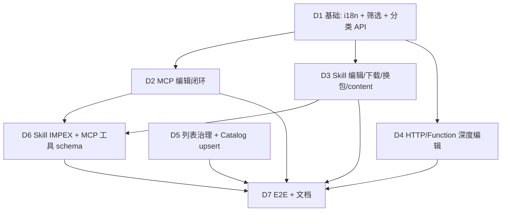

# 能力补齐计划（Lab vs 正式版）

> 目标：在不切换菜单/目录的前提下，将 `execution-factory-lab` 与正式版 `execution-factory` 的能力差距补齐到可替换水位。
> 原则：BFF 代理 OI，不改 `operator-integration` / 旧版前端。

## 依赖与顺序

## Phase D1 — 基础体验

| 项 | 后端 | 前端 | 验收 |
|----|------|------|------|
| zh-CN 完整文案 | — | `utils/gap-fill-i18n-zh.ts` + locale merge | 无 fallback key |
| 发布状态筛选 | `ListCapabilities(status=)` | 列表 Select | LAB-API-23 ✅ |
| 分类 API | `GET /categories` | 创建表单 Select（待接） | LAB-API-24 ✅ |

## Phase D2 — MCP 编辑

| 项 | 后端 | 前端 | 验收 |
|----|------|------|------|
| MCP 元数据更新 | `PATCH /capabilities/:id` (mcp) | 详情抽屉编辑 | LAB-API-25 ✅ |
| MCP 工具列表 | `GET /capabilities/:id/mcp/tools` | 详情概览 Table | LAB-API-26 ✅ |

## Phase D3 — Skill 闭环

| 项 | 后端 | 前端 | 验收 |
|----|------|------|------|
| 元数据编辑 | `PATCH ...` (skill) | 详情编辑区 | LAB-API-27 ✅ |
| 换包升级 | `PUT .../skill/package` | 换包 Upload | LAB-API-28 ✅ |
| 下载包 | `GET .../skill/download` | 下载按钮 | LAB-API-29 ✅ |
| content 导入 | `POST /capabilities/skill` content | ImportSkill 双模式 | LAB-API-30 ✅ |

## Phase D4 — HTTP / Function 深度编辑

| 项 | 后端 | 前端 | 验收 |
|----|------|------|------|
| HTTP OpenAPI 编辑 | `PATCH` + openapi_spec | 详情 TextArea | LAB-API-31 ✅ |
| Function 代码/IO 编辑 | `PATCH` function | Function 编辑区 | LAB-API-32 ✅ |

## Phase D5 — 治理与市场

| 项 | 后端 | 前端 | 验收 |
|----|------|------|------|
| Catalog upsert 安装 | 已有 install mode | CatalogCard 模式 Select | LAB-API-33 ✅ |
| 创建时 category | 已有字段 | 各创建抽屉（待接） | — |

## Phase D6 — IMPEX 与 schema

| 项 | 后端 | 前端 | 验收 |
|----|------|------|------|
| Skill 导出 | `GET .../export` skill package JSON | 详情导出按钮 | LAB-API-34 ✅ |

## Phase D7 — E2E 与文档

- `LAB-API-23` … `LAB-API-34` ✅
- 更新 `PRODUCTION.md` Phase D ✅

## 明确不在本计划（需产品单独决策）

| 能力 | 原因 |
|------|------|
| 算子独立 Tab / CRUD | 架构决策：Lab 以编排附属算子，非一等公民 |
| 工具箱多工具管理页 | 能力优先隐藏 toolbox，需单独 PR |
| Flow 编排 IDE | 正式版亦未实现 |
| 资源级授权 PMS | 接网关/JWT 后单独立项 |
| kind=all 后端 DB 视图 | 性能优化专项 |
