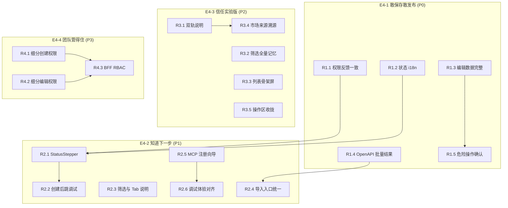

# 实验版能力库 — 心路修复计划（Iteration 4+）

> 依据 [UX-PLAN.md](./UX-PLAN.md) 三迭代完成后的**用户心路分析**制定。
> 目标：解决「语义不一致、操作不可预期、心理不安全、双轨不信任」四类摩擦。
> 原则：不切换菜单/目录；BFF 契约尽量不变；后端 RBAC 单列 Phase E4。

## 与用户心路的映射

| 心路阶段 | 当前痛点摘要 | 本计划对应 |
|----------|--------------|------------|
| 0 发现入口 | 双轨关系不清、侧栏无实验提示 | E4-3.1 ~ E4-3.3 |
| 1 列表扫读 | 筛选难懂、记忆不全、Loading 简陋 | E4-2.4 ~ E4-2.6 |
| 2 冷启动 | 缺推荐路径、市场安装模式过重 | E4-2.1 ~ E4-2.3 |
| 3 创建路径 | 批量导入只开第一个、MCP 盲注册、.adp 难发现 | E4-2.2、E4-2.7 ~ E4-2.8 |
| 4 创建成功 | 不知下一步、状态英文、未跳调试 | E4-1.1 ~ E4-1.3 |
| 5 详情治理 | 权限消失、编辑空字段、危险操作不对称 | E4-1.4 ~ E4-1.8 |
| 6 市场闭环 | 无来源溯源、无反向链回市场 | E4-3.4 ~ E4-3.5 |
| 7 长期双轨 | 信任与治理 | E4-3.x + E4-4.x |

## 依赖与实施顺序

**建议落地顺序**：E4-1（P0 全做）→ E4-2 → E4-3 → E4-4（RBAC 可与前端权限细分并行）。

---

## E4-1 — 敢保存、敢发布（P0）

**业务目标**：消除误操作与「功能消失」带来的不信任；状态与列表语义一致。

| ID | 项 | 用户故事 | 改动要点 | 主要文件 | 验收 |
|----|----|----------|----------|----------|------|
| R1.1 | 详情权限反馈一致 | 作为只读用户，我希望看到灰掉按钮和原因，而不是按钮不见了 | 详情操作区（发布/编辑/调试/编排/删除）由 `PermissionGate` 改为 `LabPermissionHint`；无权限时 disabled + Tooltip | `CapabilityDetailDrawer.tsx` | 无 `mcpPublish` 时发布按钮可见但灰掉，Tooltip 与列表一致 |
| R1.2 | 状态全面 i18n | 作为中文用户，详情里状态不应是 `draft` 英文字面量 | 抽取 `formatCapabilityStatus(status)`；详情 Tag、版本 Tab 状态列复用 | `utils/capability-status.ts`、`CapabilityDetailDrawer.tsx`、`CapabilityCard.tsx` | 详情状态显示「草稿/已发布/已下线」 |
| R1.3 | 编辑前数据完整 | 作为编辑者，我点编辑时不能看到空的 OpenAPI/URL/代码 | 打开编辑前：HTTP 拉 openapi（若 API 无字段则只读展示「在导入中维护」）；MCP 用 `detail` + `getCapability` 回填 URL；Function 拉 code（需确认 BFF 是否返回，否则编辑区只读 + 提示） | `CapabilityDetailDrawer.tsx`、必要时 `capabilities-lab.service.ts` / 后端 GET 扩展 | 进入编辑模式时已有字段非误清空；无数据时禁用保存并提示 |
| R1.4 | OpenAPI 批量导入结果 | 作为导入者，我粘贴 OpenAPI 后应知道导入了几个能力 | `ImportOpenApiDrawer` 成功后 Modal：共 N 条、打开第 1 条详情；列表对 `boxId` 下多条 `highlight` 或筛选到该分组 | `ImportOpenApiDrawer.tsx`、`CapabilityLabListScene.tsx` | 导入 3 个 API 时 Modal 显示 3，列表可见 3 条（或分组内 3 条） |
| R1.5 | 危险操作确认对齐 | 作为 Skill 维护者，换包和回滚应与下线一样需确认 | Skill 换包、版本「回滚并发布」加 `Popconfirm`；换包接 `skillPublish` 或 `capabilityEdit` 权限门 | `CapabilityDetailDrawer.tsx` | 换包/回滚均有确认；无权限灰掉 |

**E4-1 里程碑**：P0 五项 E2E 或手工用例通过；无新增 blocker 级 lint/type 错误。

---

## E4-2 — 知道下一步干什么（P1）

**业务目标**：创建后主链路有引导；降低筛选与调试认知成本。

| ID | 项 | 用户故事 | 改动要点 | 主要文件 | 验收 |
|----|----|----------|----------|----------|------|
| R2.1 | 详情 StatusStepper | 作为新接入者，我希望看到「草稿 → 调试 → 发布」建议 | 概览 Tab 顶部 `Steps` 或轻量 Alert：按 `status` + 是否已调试高亮当前步；已发布显示完成态 | `CapabilityDetailDrawer.tsx`、i18n | 草稿能力显示「建议先调试」 |
| R2.2 | 创建后默认调试 Tab | 作为工程师，HTTP/MCP/Function 创建后我想直接验通 | `CapabilityDetailDrawer` 增加 `initialTab` prop；`openCreatedCapability` 传入 `debug`（Skill 仍 `overview`） | `CapabilityDetailDrawer.tsx`、`CapabilityLabListScene.tsx` | 创建 HTTP 后抽屉停在调试 Tab |
| R2.3 | 筛选与 Tab 说明 | 作为首次用户，我想知道「分组」是什么 | 筛选区 `分组` 旁 Tooltip；编排 Tab `disabled` 时 Tooltip「仅 HTTP」；调试 Tab 对 Skill 隐藏或说明不可调试 | `CapabilityLabListScene.tsx`、`CapabilityDetailDrawer.tsx` | hover 可见说明文案 |
| R2.4 | 冷启动分步引导 | 作为冷启动用户，我希望有推荐路径 | 空态增加 3 步：① 市场安装 ② 调试 ③ 发布（链到 catalog / 添加） | `CapabilityLabListScene.tsx`、i18n | 真空态展示步骤条或有序列表 |
| R2.5 | 市场安装模式简化 | 作为业务用户，默认「新建副本」即可 | `CatalogCard` 默认 `create`；`upsert` 收到「高级」折叠或二次点击 | `CatalogCard.tsx` | 首屏仅「安装」主按钮 |
| R2.6 | 导入 .adp 入口统一 | 作为管理员，我不应单独发现「导入包」按钮 | `.adp` 并入「添加能力」→ 高级分组；或空态第三 CTA | `CapabilityLabListScene.tsx` | 添加菜单含导入包 |
| R2.7 | MCP 注册向导 | 作为 MCP 接入者，我希望先解析工具再提交 | `RegisterMcpDrawer` 分步：URL → 解析（feature 开时必选）→ 确认工具表 → 注册；解析失败阻止提交或强提示 | `RegisterMcpDrawer.tsx` | 未解析时提交按钮 disabled 或二次确认 |
| R2.8 | 调试体验对齐 | 作为 HTTP 调试者，我也想要示例 payload | HTTP 调试 Tab 增加「填充示例」；可选默认展开 JSON Collapse（与 Function 一致） | `CapabilityDetailDrawer.tsx` | HTTP 一键填充 `{"city":"beijing"}` |

---

## E4-3 — 信任这个实验版（P2）

**业务目标**：双轨身份清晰；列表与市场形成双向闭环；感知质量提升。

| ID | 项 | 用户故事 | 改动要点 | 主要文件 | 验收 |
|----|----|----------|----------|----------|------|
| R3.1 | 双轨关系说明 | 作为管理员，我想知道 Lab 与正式版区别 | 列表 intro 下 `Collapse`：数据是否隔离、推荐场景、迁移计划（文案产品定稿） | `CapabilityLabListScene.tsx`、i18n | 可展开阅读对比说明 |
| R3.2 | 侧栏实验标识 | 作为用户，侧栏应能看出是实验入口 | `navigation.tsx` labelKey 或 shell locale 加 `(Lab)`；与列表 Badge 文案一致 | `navigation.tsx`、`shell` locale | 侧栏可见实验标识 |
| R3.3 | 筛选全量记忆 | 作为回访用户，搜索和分组也应记住 | 扩展 `useLabListFilters`：`keyword`、`groupId`（debounce 写 storage） | `useLabListFilters.ts`、`CapabilityLabListScene.tsx` | 刷新后 keyword/group 恢复 |
| R3.4 | 列表骨架屏 | 作为用户，加载时不应只有一行 Loading 文字 | 卡片 `Skeleton` × pageSize；筛选 loading 时 disable | `CapabilityLabListScene.tsx`、`capability-lab.module.css` | 首屏骨架 6~8 卡 |
| R3.5 | 分页空态 | 作为用户，无数据时不应看到无意义分页 | `total === 0` 时隐藏 `Pagination` | `CapabilityLabListScene.tsx` | 空列表无分页条 |
| R3.6 | 市场来源溯源 | 作为安装者，我想在详情看到「来自市场 xxx」 | 若后端有 `catalog_source_id` / `source` 字段则展示；否则安装时写入 metadata（需 BFF 评估） | 前后端协商；`CapabilityDetailDrawer.tsx` | 从市场安装的能力显示来源名 |
| R3.7 | 反向链回市场 | 作为用户，我想从能力跳回市场条目 | 详情「在市场查看」链到 catalog 并带 search/id（若可） | `CapabilityDetailDrawer.tsx`、`CatalogLabListScene.tsx` | 点击跳转市场对应项 |
| R3.8 | 删除移入「更多」 | 作为操作者，首行只保留 Publish / Edit | 删除从首行移到 `moreMenuItems`；首行视觉更轻 | `CapabilityDetailDrawer.tsx` | 首行无红色删除按钮 |

---

## E4-4 — 团队管得住（P3）

**业务目标**：前后端权限模型一致；细分到能力类型；避免「假安全」。

| ID | 项 | 用户故事 | 改动要点 | 主要文件 | 验收 |
|----|----|----------|----------|----------|------|
| R4.1 | 列表创建权限细分 | 作为只有 MCP 权限的用户，我不应看到可用的 HTTP 创建 | `addMenuItems` 各项包 `LabPermissionHint`：`http`→`capabilityCreate`，`mcp`→`mcpCreate`，`skill`→`skillCreate`，`function`→`functionCreate` | `CapabilityLabListScene.tsx` | 仅 mcpCreate 时 HTTP 项灰掉 |
| R4.2 | 详情编辑权限细分 | 作为 Skill 编辑者，应用 skill 维度权限而非泛化 edit | 编辑按钮：`skill`→`capabilityEdit` 或新增 `skillEdit`；与 `permissions.ts` 对齐 | `CapabilityDetailDrawer.tsx`、`permissions.ts` | 各 kind 编辑门与发布/删除一致 |
| R4.3 | 列表页 capabilityView | 作为无 view 权限用户，整页应不可见 | 列表外包 `PermissionGate(capabilityView)`，与 catalog 一致 | `CapabilityLabListScene.tsx` | 无 view 权限显示无权限页 |
| R4.4 | Function 沙箱权限 | 作为无 debug 权限用户，创建抽屉沙箱应灰掉 | `AddFunctionCapabilityDrawer` 运行 Python 接 `LabPermissionHint(functionDebug)` | `AddFunctionCapabilityDrawer.tsx` | 无权限时沙箱按钮灰掉 |
| R4.5 | BFF 路由 RBAC（可选） | 作为安全负责人，前端灰掉不够 | `capabilities-lab` BFF：对 POST/PATCH/DELETE 校验 permission header 或 session；与 `permissions.ts` 映射表 | `bknfoundry/.../capabilities-lab` middleware | 直调 API 无权限返回 403 |

> **R4.5** 依赖安全/平台评审，可拆独立 PR，不阻塞 E4-1~3 前端交付。

---

## 测试与文档

| 类型 | 范围 |
|------|------|
| **手工用例** | `docs/REPAIR-MANUAL.md`（待建）：P0 五条 + 创建后调试 Tab + OpenAPI 批量 |
| **E2E** | `e2e-lab-ui.spec.ts`：权限灰态、创建→调试 Tab、空态步骤（可选） |
| **API** | OpenAPI 导入多 capability 响应结构不变；若 R1.3 需 GET 扩展则补 LAB-API-xx |
| **文档** | 更新 `UX-PLAN.md` 增加 Iteration 4 索引；`PRODUCTION.md` 增加 Phase E |

---

## 排期建议（可按 PR 拆分）

| PR | 范围 | 预估 | 依赖 |
|----|------|------|------|
| **PR-E4-1a** | R1.1 + R1.2 + R1.5 | 0.5~1d | — |
| **PR-E4-1b** | R1.3 + R1.4 | 1~2d | 确认 GET capability 是否含 openapi/code/url |
| **PR-E4-2a** | R2.1 + R2.2 + R2.8 | 1d | E4-1a |
| **PR-E4-2b** | R2.3~R2.7 | 1~1.5d | — |
| **PR-E4-3** | R3.1~R3.8 | 1.5~2d | 部分依赖产品文案 |
| **PR-E4-4** | R4.1~R4.4 前端 | 1d | — |
| **PR-E4-4b** | R4.5 BFF RBAC | 2~3d | 平台评审 |

---

## 实施状态

| 阶段 | 状态 |
|------|------|
| E4-1 P0 | ✅ 已完成 |
| E4-2 P1 | ✅ 已完成 |
| E4-3 P2 | ✅ 已完成（R3.6 来源字段待后端 metadata） |
| E4-4 P3 | ✅ 前端已完成（R4.5 BFF RBAC 未做） |

---

## 不在本计划内（明确排除）

- 切换正式版菜单 / 下线 `execution-factory` 旧模块
- 大规模重构详情为独立路由页
- 工作流编排编辑器本体改动

---

## 相关文档

- [UX-PLAN.md](./UX-PLAN.md) — Iteration 1~3（已完成）
- [GAP-PLAN.md](./GAP-PLAN.md) — 与正式版能力差距（Phase D 已完成）
- [PRODUCTION.md](./PRODUCTION.md) — 生产化总路线图
