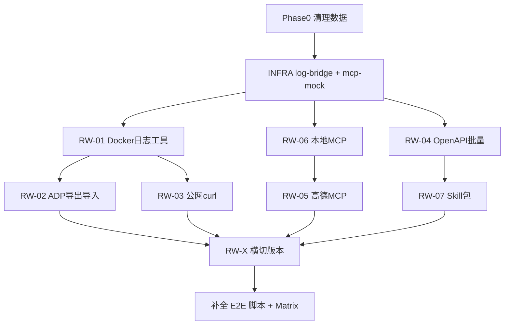

# Execution Factory 实战场景 E2E 执行计划

目标：清空历史测试数据后，用**真实/近真实**场景跑通工具 / MCP / Skill 全链路（创建 → 调试 → 编辑 → 发布多版本 → 调用），并将缺口补入 Playwright E2E。

**范围**：`execution-factory-dev` 本地栈 + `bkn-studio` Capability UX v2。

---

## 0. 前置条件

```powershell
cd d:\workspace\openbkn\execution-factory-dev
docker compose up -d
docker compose -f docker-compose.sandbox.yml up -d   # 函数沙箱 + docker.sock
```

| 服务 | 端口 | 用途 |
|------|------|------|
| ef-studio | 5173 | 前端 |
| agent-operator-integration | 9000 | ADP API |
| ef-api-gateway | 9010 | 浏览器 CORS 网关 |
| sandbox-control-plane | 8000 | 函数执行 / MCP 代理调试 |
| ef-mf-model-mock | 9898 | AI 生成 |
| ef-oss-mock | 8080 | Demo HTTP |

**环境变量（新增）**

| 变量 | 说明 |
|------|------|
| `E2E_AMAP_MCP_SSE_URL` | 高德 MCP SSE 地址（场景 5，勿提交密钥到仓库） |
| `E2E_LOG_BRIDGE_URL` | Docker 日志桥接服务（场景 1，默认 `http://127.0.0.1:8095`） |
| `E2E_LOCAL_MCP_SSE_URL` | 本地 MCP SSE（场景 6，默认 `http://127.0.0.1:8096/sse`） |
| `E2E_ALLOW_NETWORK` | `1` 时启用外网 API 用例（uapis / 高德） |

---

## 1. Phase 0 — 清空测试数据（必须先做）

### 1.1 清理范围

删除所有 E2E / demo / 手工残留资源：

- 算子：`name` 匹配 `at_e2e_*`、`e2e_*`、`demo_*`、`quick_api_*`
- 工具箱：同上
- MCP：`tool_imported` + 测试前缀
- Skill：`at_e2e_skill_*`

### 1.2 实现任务

| 任务 | 产出 | 说明 |
|------|------|------|
| P0-1 | `scripts/cleanup-e2e-assets.ps1` | 调用 list API 分页删除 operator/toolbox/mcp/skill |
| P0-2 | `helpers/cleanup-all.ts` | Playwright `beforeAll` 可复用；支持 `--dry-run` |
| P0-3 | 重置 `demo_assets.json` | 可选：仅保留 seed 脚本引用 ID，不保留脏数据 |

### 1.3 验收

```powershell
# 列表 API 返回 total=0（或仅剩 internal 内置资源）
curl "http://127.0.0.1:9000/api/agent-operator-integration/v1/tool-box/list?page=1&page_size=5" -H "x-business-domain: bd_public"
```

---

## 2. 场景矩阵（7 + 横切）

每个场景统一走 **5 步验收**：`创建 → 调试/调用 → 编辑 → 发布 v2 → 再调用/市场可见`

| 场景 | ID | 类型 | 核心路径 | 依赖基础设施 |
|------|-----|------|----------|--------------|
| 1 Docker 错误日志 | RW-01 | 工具集 | Quick-add / OpenAPI → 调试 | **log-bridge** 新服务 |
| 2 ADP 导出再导入 | RW-02 | 工具集 | 导出 `.adp.json` → UI 备份导入 clone | 无 |
| 3 公网 curl API | RW-03 | 工具集 | cURL → uapis 天气 | 外网（可 skip） |
| 4 OpenAPI 3.0 批量 | RW-04 | 工具集 | 粘贴 `uapis-weather-mini.json` 多接口 | fixture 文件 |
| 5 高德 MCP | RW-05 | MCP | SSE 注册 + proxy 调试 | `E2E_AMAP_MCP_SSE_URL` |
| 6 本地 MCP | RW-06 | MCP | 本地 SSE server 注册 + 调试 | **ef-mcp-mock** 新服务 |
| 7 Skill 包 | RW-07 | Skill | zip 上传 → 详情预览 → 下载 | OSS 网关正常 |
| 横切 版本/编辑 | RW-X | 全部 | 各场景至少 1 次 edit + publish + history | 已有 VER API |

---

## 3. 分场景执行步骤

### RW-01：Docker 容器最新错误日志工具

**思路**：沙箱函数直接调 docker 不稳定；增加轻量 **log-bridge** HTTP 服务（读 `docker.sock`），工具通过 OpenAPI/cURL 调用。

| 步骤 | 动作 |
|------|------|
| 1 | 新增 `execution-factory-dev/log-bridge/`（Python/Go），暴露 `GET /logs/{container}?tail=200&level=error` |
| 2 | `docker-compose.yml` 增加 `ef-log-bridge:8095`，挂载 `docker.sock`，白名单容器：`ef-operator-integration`、`ef-api-gateway`、`ef-studio` |
| 3 | Studio **Quick-add API**：`curl 'http://127.0.0.1:8095/logs/ef-operator-integration?tail=50&level=error'` |
| 4 | 进入工具集 → 调试 → 断言响应含 `ERR` 或日志行 |
| 5 | 编辑工具描述 → 发布 → 版本历史 ≥2 → 再调试 |

**E2E 新增**：`RW-01` API + `RW-UI-01` UI（quick-add + debugToolFromToolsPage）

---

### RW-02：导出 ADP 包 → 导入生成新工具集

**思路**：复用 IMPEX backup；强调**导入后工具可调试**。

| 步骤 | 动作 |
|------|------|
| 1 | 用 RW-01 或 QA-01 创建并**发布**工具箱 |
| 2 | 卡片菜单 **导出** → 得到 `import.adp.json` |
| 3 | **导入 → 备份文件 → 新建**，改 `metadata.name` 后缀 `_clone` |
| 4 | 打开克隆工具箱 → 对首个工具 **调试** 通过 |
| 5 | 编辑元数据 → 再发布 → 市场/列表可见两个版本线 |

**E2E 新增**：`RW-02` 扩展 IMPEX-UI-05（加 debug 断言）；API `RW-02-api` clone + execute

---

### RW-03：公网 curl（地图/搜索类 API）

**思路**：以 **uapis 天气** 为稳定公网样例（仓库已有 `uapis-weather-mini.json`）。

| 步骤 | 动作 |
|------|------|
| 1 | Quick-add：`curl 'https://uapis.cn/api/v1/misc/weather?city=北京'` |
| 2 | 调试断言：`city` / `weather` / `temperature` 字段存在 |
| 3 | 编辑工具 summary → 再调试 |
| 4 | 发布 → 导出备份 |

**E2E**：强化 `QA-05`（默认 skip 无网络）；`RW-03` 使用 mini spec 离线 mock 版（指向 ef-oss-mock 代理天气 JSON）+ 在线 optional

**可选扩展**：高德 REST（需 key）→ 单独 manual；不进 CI 默认路径。

---

### RW-04：OpenAPI 3.0 协议包批量导入

| 步骤 | 动作 |
|------|------|
| 1 | 将 `uapis-weather-mini.json` 复制到 `tests/e2e/fixtures/uapis-weather-mini.json` |
| 2 | 工具集 → **导入 → OpenAPI** → 粘贴全文 → IO 预览 ≥1 operation |
| 3 | **提交导入**（当前 CAP-V2-08/09 只测预览，需补 submit） |
| 4 | 工具列表 ≥1；逐个抽样调试 |
| 5 | 编辑工具箱描述 → 发布 |

**E2E 新增**：

- `RW-04-api`：已有 TB-05 batch API，换真实 fixture
- `RW-UI-04`：`submitImportModal` + 列表计数 + debug

---

### RW-05：高德可用 MCP 服务

| 步骤 | 动作 |
|------|------|
| 1 | 配置 `E2E_AMAP_MCP_SSE_URL`（参考 `mcp_remote.http`，密钥放 `.env.local`） |
| 2 | MCP → 添加能力 → SSE URL → 解析工具列表 |
| 3 | 注册 → 详情页查看工具 → **proxy 调试** 任一工具（如地理编码） |
| 4 | 编辑 MCP 描述 → 发布 → 导出备份 |

**E2E 新增**：`RW-05-api`（parse + register + internal proxy call）；`RW-UI-05`（详情 + debug modal）

**风险**：外网/配额；CI 默认 `test.skip` unless `E2E_ALLOW_NETWORK=1`

---

### RW-06：本地 MCP 服务注册

| 步骤 | 动作 |
|------|------|
| 1 | 新增 `execution-factory-dev/mcp-mock/`（Node `@modelcontextprotocol/sdk` 或 Python FastMCP） |
| 2 | 暴露 `http://ef-mcp-mock:8096/sse`，工具：`echo`、`get_time` |
| 3 | operator-integration 容器内 URL：`http://ef-mcp-mock:8096/sse`（同 ef-dev 网络） |
| 4 | Studio 注册 → 详情调试 `echo` |
| 5 | 编辑 headers → 发布 → 版本历史 |

**E2E 新增**：`RW-06-api` + `RW-UI-06`（全 UI 注册流程，填补 UI-COV-010 缺口）

---

### RW-07：本地 Skill 常用功能包

| 步骤 | 动作 |
|------|------|
| 1 | 准备 zip：`SKILL.md` + `refs/guide.md` + `scripts/run.py`（常用模板：文件读取/命令说明） |
| 2 | UI **添加能力 → Skill → 上传 zip**（填补「仅 API 创建」缺口） |
| 3 | 详情页：预览 `refs/guide.md`、`SKILL.md` |
| 4 | 下载包 → 更新包（替换 `SKILL.md`）→ 预览新版本 |
| 5 | 发布 → 发布历史 ≥2 → 市场列表可见 |

**E2E 新增**：

- `RW-07-ui`：wizard 上传 + UI-COV-028 预览 + `updateSkillPackage` UI
- `RW-07-api`：SK-01..05 已有，补 republish UI（VER-UI-02 扩展）

---

## 4. 横切：编辑 / 版本 / 调用（RW-X）

对 RW-01..07 各抽 1 条资源，统一跑：

| 检查项 | API | UI |
|--------|-----|-----|
| 编辑元数据保存 | PUT toolbox/mcp/skill | Drawer/表单保存 toast |
| 首次发布 | status=published | 卡片 Tag 变绿 |
| 二次变更再发布 | history count +1 | 版本/发布历史 drawer |
| 下线再上线 | offline → published | Tag 变化 |
| 调用/调试 | tool debug / mcp proxy / skill download | debug modal / detail |

**新套件**：`e2e-realworld-lifecycle.spec.ts`（API）+ `e2e-realworld-ui.spec.ts`（UI smoke）

---

## 5. E2E 脚本补充清单

### 5.1 新文件

| 文件 | 内容 |
|------|------|
| `fixtures/uapis-weather-mini.json` | 从 repo root 同步 |
| `fixtures/skill-realworld.zip` | 构建脚本生成 |
| `helpers/cleanup-all.ts` | Phase 0 批量清理 |
| `helpers/log-bridge.ts` | 健康检查 + 样例 curl |
| `helpers/mcp-realworld.ts` | 高德/本地 MCP 注册封装 |
| `specs/execution-factory/e2e-realworld.spec.ts` | RW-01..07 API |
| `specs/execution-factory/e2e-realworld-ui.spec.ts` | RW-UI-01..07 |

### 5.2 需增强的现有 spec

| 现有 ID | 增强内容 |
|---------|----------|
| CAP-V2-08/09 | OpenAPI 导入 **提交** + 工具落库 |
| IMPEX-UI-04 | MCP 备份 **导入** clone |
| IMPEX-UI-05 | 导入后 **debug** 断言 |
| QA-05 | 稳定离线/在线双模式 |
| UI-COV-010 | MCP wizard **完整注册** |
| UI-COV-026 | Skill **下载/更新包** 点击流 |
| VER-UI-02 | Skill **republish** UI |
| TB-05 | 使用 `uapis-weather-mini.json` fixture |

### 5.3 新 Matrix ID（写入 `E2E_TEST_MATRIX.md`）

```
RW-01..07      API 实战场景
RW-UI-01..07   UI 实战场景
RW-X-01..05    横切生命周期
P0-CLEAN       启动前清理
```

### 5.4 package.json scripts

```json
"test:realworld": "playwright test specs/execution-factory/e2e-realworld*.spec.ts",
"test:realworld:api": "playwright test specs/execution-factory/e2e-realworld.spec.ts",
"pretest:realworld": "node -e \"require('./helpers/cleanup-all')\" "
```

---

## 6. 基础设施新增（dev 栈）

| 组件 | 路径 | 端口 | 场景 |
|------|------|------|------|
| ef-log-bridge | `execution-factory-dev/log-bridge/` | 8095 | RW-01 |
| ef-mcp-mock | `execution-factory-dev/mcp-mock/` | 8096 | RW-06 |
| uapis 离线代理（可选） | ef-oss-mock 增 route `/proxy/uapis/*` | 8080 | RW-03 CI 稳定 |

---

## 7. 执行顺序（DAG）



**建议迭代**（约 4 个 PR）：

1. **PR-1**：P0 清理 + log-bridge + RW-01/02 + E2E RW-01/02
2. **PR-2**：OpenAPI fixture + RW-04 + CAP-V2 submit 修复
3. **PR-3**：mcp-mock + RW-06 + RW-05(optional) + MCP UI E2E
4. **PR-4**：Skill UI wizard RW-07 + 横切 RW-X + Matrix 更新

---

## 8. 通过标准（Definition of Done）

- [ ] Phase 0 清理后列表无 `at_e2e_*` 残留
- [ ] RW-01..07 各有一份 **API 自动化** 用例绿灯
- [ ] RW-01..07 各有一份 **UI 冒烟** 用例绿灯（外网项可 `skip`）
- [ ] 每场景至少验证：**编辑保存 + 发布 + 历史/版本 + 调试/调用**
- [ ] `E2E_TEST_MATRIX.md` 与 `e2e-realworld*.spec.ts` 同步
- [ ] `npm run test:realworld` 在完整 dev 栈下一次性通过
- [ ] 密钥（高德 key）不入库，仅 `.env.example` 说明

---

## 9. 与当前 E2E 差距摘要

| 用户要求 | 已有 | 缺口 |
|----------|------|------|
| Docker 日志工具 | 无 | log-bridge + RW-01 全新 |
| ADP 导入新工具箱 | IMPEX API + 部分 UI | 导入后 debug + 工具级断言 |
| 公网 curl | QA-05 optional | 离线替身 + 稳定断言 |
| OpenAPI 3.0 批量 | TB-05 API | UI submit + 真实 fixture |
| 高德 MCP | mcp.http 手工 | 自动化 + env 密钥 |
| 本地 MCP | 文档 deferred | mcp-mock 容器 + UI 全链路 |
| Skill 预览/功能 | SK-05, UI-COV-028 | UI 创建/更新包/republish |
| 编辑+多版本 | VER API 为主 | 每场景 UI 绑定 |

---

## 10. 下一步（建议立即执行）

1. 实现 **P0-1/P0-2** 清理脚本并跑一遍清空环境
2. 搭建 **ef-log-bridge**（RW-01 阻塞项）
3. 新建 `e2e-realworld.spec.ts` 骨架，先落 RW-02（无新基建，最快验证 impex 闭环）
4. 并行开发 **ef-mcp-mock** 供 RW-06

完成以上四步后，按 DAG 顺序推进剩余场景并回填 Matrix。
